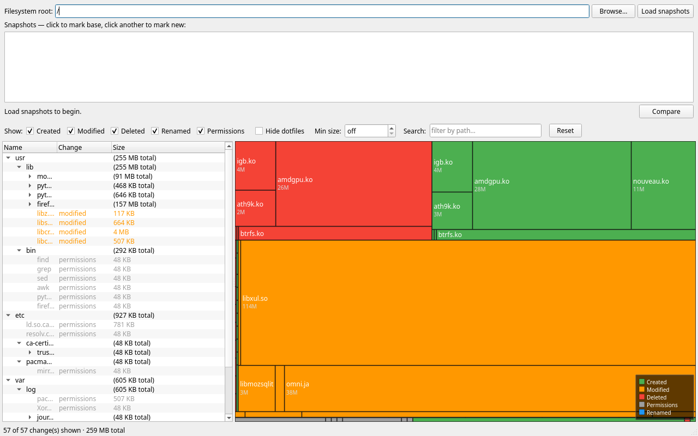

# btrmap

A PyQt6 desktop tool that visually compares two read-only btrfs snapshots.  It uses
`btrfs send --no-data | btrfs receive --dump` to get a ground-truth diff at the
filesystem level, then shows the results as an interactive collapsible file tree and
a squarified treemap — with large changed files immediately dominant in the view.



---

## Features

| Feature | Detail |
|---|---|
| **Ground-truth diff** | Uses `btrfs send` — the same engine the kernel uses for incremental sends; no rsync, no recursive `find` |
| **Squarified treemap** | File sizes visualised proportionally; a 29 MB kernel module dominates at a glance |
| **Collapsible tree view** | Navigate the full diff; selecting a node in either view cross-highlights it in the other |
| **Live progress** | Status bar reports each phase: scanning, building tree, measuring sizes |
| **Filtering** | Filter by change type, hide dotfiles/hidden directories, set a minimum file size, or search by path substring |
| **Keyboard shortcuts** | `Ctrl+F` focuses path search; `Ctrl+R` resets all filters |
| **Persistent layout** | Splitter position saved and restored across sessions via `QSettings` |

### Change types and colours

| Colour | Meaning |
|---|---|
| Green | Created |
| Orange | Modified |
| Red | Deleted |
| Blue | Renamed (expanded to Deleted + Created in the tree) |
| Grey | Permissions / timestamps only (`utimes`, `chmod`, `chown`) |

---

## Requirements

| Requirement | Version |
|---|---|
| Linux | required — btrfs is Linux-only |
| Python | ≥ 3.11 |
| PyQt6 | ≥ 6.6 |
| btrfs-progs | any recent version |

```bash
# Arch Linux
sudo pacman -S btrfs-progs python

# Debian / Ubuntu
sudo apt install btrfs-progs python3
```

---

## Installation

```bash
git clone https://github.com/nimaajhep/btrmap.git
cd btrmap

# With uv (recommended)
uv sync

# Or with pip
pip install -e .
```

---

## Usage

The `btrfs send` command requires `root` or `CAP_SYS_ADMIN`:

```bash
sudo uv run btrmap
# or, after pip install:
sudo btrmap
```

### Workflow

1. **Set filesystem root** — the mount point of your btrfs filesystem (e.g. `/` or `/home`).
2. **Load snapshots** — lists all read-only subvolumes under that path.
3. **Select base and new** — click one snapshot to mark it as the base (amber), then
   another to mark it as new (green).  The earlier snapshot is always the base regardless
   of click order.
4. **Compare** — the diff runs in a background thread; progress appears in the status bar.
5. **Explore** — browse the tree view or click a treemap cell; both views stay in sync.
6. **Filter** — use the filter bar to narrow results.

### Snapper integration

If you use [snapper](https://github.com/openSUSE/snapper), snapshots live under
`.snapshots/<N>/snapshot` relative to the subvolume root.

```
Filesystem root: /          → lists snapshots under @/.snapshots/
Filesystem root: /home      → lists snapshots under @home/.snapshots/
```

---

## Architecture

```
src/btrmap/
├── btrfs/                  # CLI wrappers — zero PyQt6 imports
│   ├── subvolumes.py       # btrfs subvolume list → list[Subvolume]
│   └── diff.py             # btrfs send | btrfs receive --dump → list[ChangeRecord]
├── model/                  # Data structures — zero PyQt6 imports
│   ├── diff_tree.py        # DiffNode / DiffTree; tree built from ChangeRecord list
│   ├── enrichment.py       # stat() each leaf to populate size_bytes
│   └── filter.py           # FilterSpec + apply_filter() — pure pruning logic
├── ui/                     # PyQt6 widgets only
│   ├── main_window.py      # top-level layout, QSplitter, signal wiring
│   ├── snapshot_selector.py# filesystem root input + snapshot list + Compare button
│   ├── filter_panel.py     # horizontal filter bar
│   ├── tree_view.py        # DiffTreeModel (QAbstractItemModel) + DiffTreeView
│   └── treemap.py          # squarify() pure function + TreemapWidget
├── utils/
│   └── subprocess.py       # sole module that calls subprocess
└── main.py                 # QApplication entry point
```

### Design constraints

- `btrfs/` and `model/` have **zero PyQt6 imports** — fully unit-testable without a display.
- All subprocess calls go exclusively through `utils/subprocess.py`.
- `squarify()` in `treemap.py` is a **pure function** — no side effects, no Qt dependency.
- Long-running operations (`compute_diff`, `enrich`) run in a `QThread` subclass; the
  main thread is never blocked.
- Cross-widget selection sync uses a `_syncing: bool` flag to prevent infinite signal loops.

---

## Development

```bash
# Run all tests (no root, no btrfs required — all subprocess calls are mocked)
uv run pytest

# Run a specific test
uv run pytest tests/test_diff_parser.py -v

# Lint
uv run ruff check src/

# Format
uv run ruff format src/

# Generate visual render PNGs for manual inspection
# Output: tests/output/render.png  tests/output/selector.png
uv run pytest tests/test_visual_render.py -v -s
```

### Test coverage

| Test file | What it covers |
|---|---|
| `test_diff_parser.py` | `_parse_line`: all 14 operation tokens, paths with spaces and Unicode, both btrfs-progs output formats, `compute_diff` error paths |
| `test_diff_tree.py` | `DiffTree.build`: parent-child structure, `total_size` aggregation, RENAMED expansion |
| `test_treemap_layout.py` | `squarify`: rects within bounds, no overlaps, area proportional to size (≤ 1% error), zero-size node handling |
| `test_enrichment.py` | Stat called on the correct snapshot mount per change type; silent failure on `OSError` |
| `test_subvolumes.py` | Output parsing, non-zero exit handling, unparseable line skipping |
| `test_filter.py` | `FilterSpec` identity fast-path, type/dotfile/size/path filters individually and combined, `count_leaves` edge cases |
| `test_visual_render.py` | Headless Qt render to PNG for human inspection (not a pass/fail test of layout) |

---

## Contributing

Pull requests are welcome.  Please run `uv run ruff check src/` and `uv run pytest`
before submitting.

---

## License

[MIT](LICENSE)
